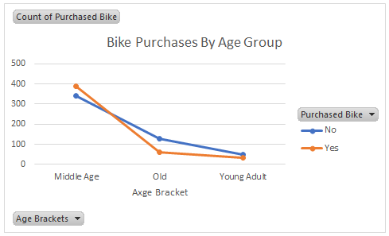
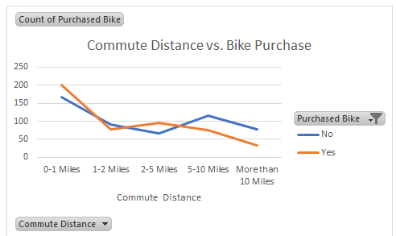
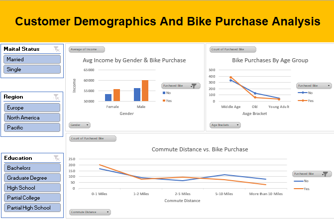

# Customer Bike Purchase Behavior Analysis

A Data Analytics project analyzing customer demographic and behavioral data to uncover patterns influencing bike purchase decisions.

---

## 📌 Project Overview

This project investigates customer-level data to explore how demographics (age, gender, income, marital status), lifestyle (car ownership, commute distance), and geography affect bike purchasing behavior. The goal is to derive insights that help in understanding customer segments likely to purchase bikes.

**Tools Used**: SQL (MySQL), Microsoft Excel  
**Records**: 1,026 rows  
**Source**: Kaggle Bike purchase dataset

---

## 🧹 Data Cleaning (Excel)

Performed data preprocessing using Excel to ensure data was ready for analysis:
- Removed duplicates, nulls, and irrelevant fields
- Standardized column names and corrected inconsistent entries
- Ensured appropriate data types for calculations

---

## 🔎 Exploratory Data Analysis (SQL)

Performed deep dive analysis using SQL:
- Bike purchases by gender, age, income, and region
- Car ownership and number of children vs bike purchases
- Commute distance and education influence

### 📊 Key Insights:

- **Gender and Purchase**: Males are slightly more likely to purchase bikes than females.
- **Income Level**: Customers who purchased bikes have a higher average income compared to non-buyers.
- **Region-wise Trends**: North America had the highest number of bike purchasers.
- **Children**: Families with 0–2 children tend to purchase more bikes.
- **Commute Distance**: Customers with commute distances between 0–1 mile are more likely to purchase bikes.
- **Education Level**: Customers with a Bachelor’s degree form the largest group of bike purchasers.
- **Car Ownership**: Those who own cars are also more likely to buy bikes — likely for leisure or short commuting.

> SQL aggregation functions (`COUNT`, `AVG`, `GROUP BY`, `CASE WHEN`) and filtering (`WHERE`, `HAVING`) were used to derive insights.

 
## 📊 Visualizations


**🔽 Bike Purchases by Age Group**  


**🔽 Bike Purchase by Gender-wise Income**  


---

## 📈 Excel Dashboard

An interactive Excel dashboard was created using Pivot Tables, Charts, and Slicers to visualize:

- Purchase rates by gender and age group
- Average income comparison
- Region-wise purchase count
- Education level vs purchase behavior
- Commute distance distribution

> Charts such as clustered bar, line chart, were used to communicate findings visually.

**📊 Dashboard Preview:**  


---

## 💻 Sample Queries Used (SQL)

```sql
-- Gender-wise bike purchase count
SELECT Gender, COUNT(*) AS Total_Buyers
FROM customer_data
WHERE Purchased_Bike = 'Yes'
GROUP BY Gender;

-- Average income of buyers vs non-buyers
SELECT Purchased_Bike, ROUND(AVG(Income), 2) AS Avg_Income
FROM customer_data
GROUP BY Purchased_Bike;

-- Bike purchase by commute distance
SELECT Commute_Distance, COUNT(*) AS Purchases
FROM customer_data
WHERE Purchased_Bike = 'Yes'
GROUP BY Commute_Distance
ORDER BY Purchases DESC;

